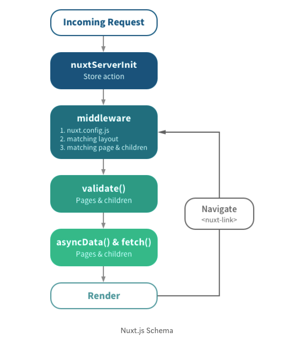

# Nuxt-Course complete

## Lifecycle



## Validate()

All user-submitted data should be validated. Nuxt offers us the validate method for this.

`validate({params, query, store}){ //body }`

## Middleware

It's a predefined function. We can apply it to a specific page or all pages. In the Nuxt lifecycle, middleware is invoked before the validate method. Because middleware is called at a very early state, we can use it to do many things, like checking login status, validating user-submitted data, etc.

Nuxt will assign context to the anonymous function as its argument value.

* Context.params and context.query can get us values passed in URL.
* Context.store gets us VueX.
* Context.error() can help us trigger error page and send value to the error page.

## Layout: customizing view


You can create de custome page layout and apply in difference pages.

```
<template>
  <div>
    <h2 style="color:red; background:#000000">Custome layout</h2>
    <nuxt /> <!--render de child router-->
  </div>
</template>
<script></script>
<style scoped></style>

```


In the child you can apply the proviedad layout

```
<script>
import Logo from '~/components/Logo.vue'

export default {
  layout:"custome", //use layout custome
  components: {
    Logo
  },
  middleware:['mv1']
}
</script>

```


<script>
import Logo from '~/components/Logo.vue'

export default {
  layout:"custome",
  components: {
    Logo
  },
  middleware:['mv1']
}
</script>

## Customizing Error Page

If you want the page error you create in layouts folder the page error.vue. You can pass error prop contente message en conde.

## AsyncData

If you do not want to use VueX in your Nuxt project, then the asyncData method is what you use to communicate with the backend program and database. AsyncData will also receive context as its argument value and  will be invoked AUTOMATICALLY.

The most important about the asyncData method is that the result it returns will be automatically merged with vue data.

AsyncData receives CONTEXT as its argument. Context gives asyncData access to context.params, context.query, context.store and context.error()

```
  async  asyncData(context) {
      const listTasks =  await axios.get("https://jsonplaceholder.typicode.com/todos")
       console.log(listTasks)
       return {listTasks: listTasks.data }
    },
```

## Nuxt VueX

The VueX config file should be stored in the store directory. The file name should be index dot js.

The config file used in Nuxt is basically the same, except one difference: we do not directly export the store method. We return it in an anonymous function and export that function. Vue.use() is optional in Nuxt VueX config file.

```
const createStore = () => {
    return new Vuex.Store({
        state:{
            listPost:[]
        },

        mutations:{
            SET_LIST_POST(state, payload){
                state.listPost = payload;
            }
        },

        actions:{
            async getPost({commit}){
                const resp = await  axios.get("https://jsonplaceholder.typicode.com/posts")
                commit("SET_LIST_POST", resp.data)
            }
        }
  
    })
}

export default createStore
```

## Fetch

You might wonder if we want to completely transfer data handling to VueX, how do we get the initial data? In Vue, we retrieve initial data using the created hook. In Nuxt, we have two options: the fetch method and the nuxtServerInit method. Both these two methods will be invoked automatically. But they will be invoked at a different timing.

1. Get to params and store (Context.store.commit)

```
<script>
import axios from 'axios'
export default {
    async fetch(context){
        const resp = await axios.get("https://jsonplaceholder.typicode.com/users/")
        context.store.commit("SET_LIST_USER", resp.data)
    },
};
</script>
```

## NuxtServerInit

NuxtServerInit is a VueX action method. Unlike ordinary action method, nuxtServerInit will be invoked automatically. In the Nuxt lifecycle, the nuxtServerInit method will be invoked at the very beginning.

The image below shows what the nuxtServerInit method looks in a real-world program.

It has two arguments: vuex_context and nuxt_context.

```
export const actions = { 
   async nuxtServerInit(vuex_context, nuxt_context){
    try {
       const resp = await  axios.get("https://jsonplaceholder.typicode.com/albums")
       vuex_context.commit("blog/SET_LIST_ALBUMS",resp.data )
    } catch (e) {
       nuxt_context.error({message:e.message})
    }
   }}
```

## Others
